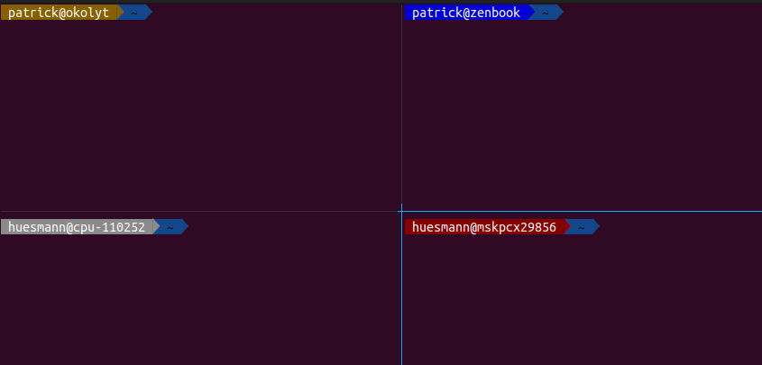

# agnoster-hostcolors

This is a fork of the [oh-my-zsh](https://github.com/ohmyzsh/ohmyzsh) [agnoster theme](https://github.com/ohmyzsh/ohmyzsh/blob/master/themes/agnoster.zsh-theme)
with the additional feature of coloring the `user@host` prompt differently for different hosts, based on a color palette and a hash of the `user@host` string.

## Installation

Clone this repository and add a symbolic link pointing at `agnoster.zsh-theme` to `~/.oh-my-zsh/custom/themes`

## Credits

Code was copied from [rixx's zsh config](https://github.com/rixx/dotfiles/commit/ca4b3740eec3f63b85fe920ea0a1d9eb3dececd1) and adapted to work with oh-my-zsh.

## Example screenshot

